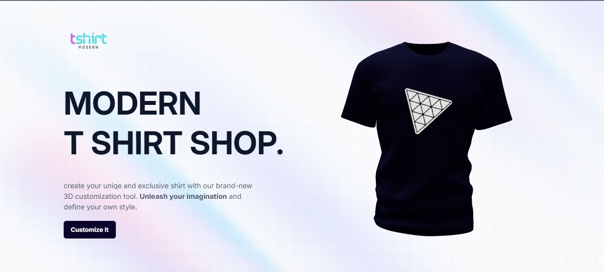
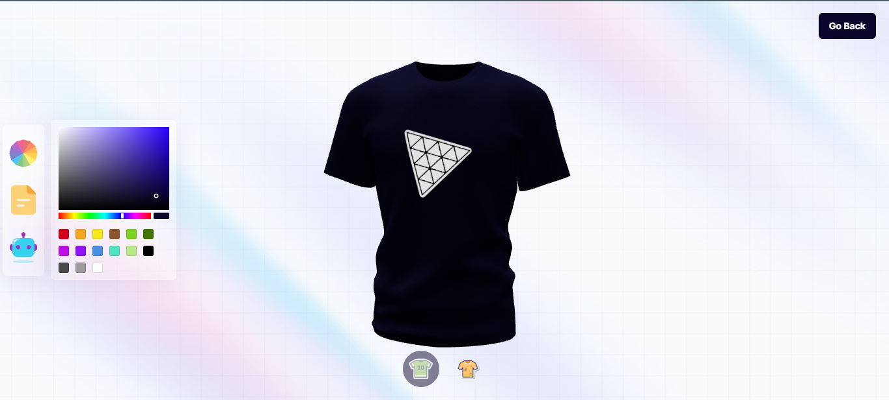

# Custom_Tshirt_Shop_wtih_ThreeJS
🔗 Live Website Link: https://modern-tshirt-shop.netlify.app




Empower your personal and business endeavors by creating unique and
exclusive shirts with our state-of-the-art 3D customization tool. Unleash
the limitless possibilities of your imagination as you define and refine your
own style using specially designed AI tools on our website, seamlessly
integrating them into both your personal and professional worlds.
### Technology: 
####  ReactJs,  Talwind css,  Freamer motion,  DALL.E AI,  ThreeJs ::::::
##### - ThreeJS - a powerful 3D graphics library for rendering and animating the 3D model
##### -  React Three Fiber - a popular library for creating 3D graphics with ThreeJS in React
##### - TailwindCSS - a popular utility-first CSS styling framework
##### -  Framer Motion - the most popular library used to bring your React website to life with animations
##### - DALL.E AI - Dall-E is a generative AI technology that enables users to create new images with text to graphics prompts. <br/> <br/>

### Here are the general steps to run a Vite project:

1. Install Node.js and npm:
Make sure you have Node.js and npm installed on your system. You can download them from the official website:

```
https://nodejs.org/en/download
```
3. Navigate to the project directory:
```
cd your-project-name
```

3. Install dependencies:
Run the following command to install project dependencies:
```
npm install
```

5. Run the development server:
Start the development server using the following command:
```
npm run dev
```


